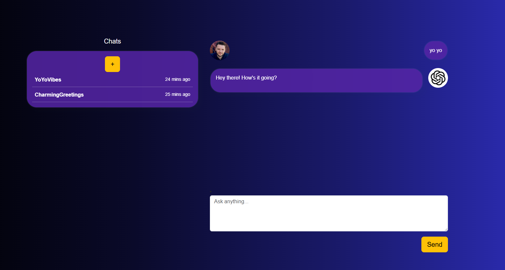

# ChatInterface

The app provides an interactive chat interface for managing conversations with AI.

## Features

- **New Chat Button** – Allows starting a new conversation.
- **Chat List Panel** – Displays all existing chats with their titles and last active time.
- **Active Chat Window** – Shows messages exchanged between the user and the AI.
- **Message Input Box** – Text area to type messages to the AI.
- **Send Button** – Sends the typed message to the active chat.

